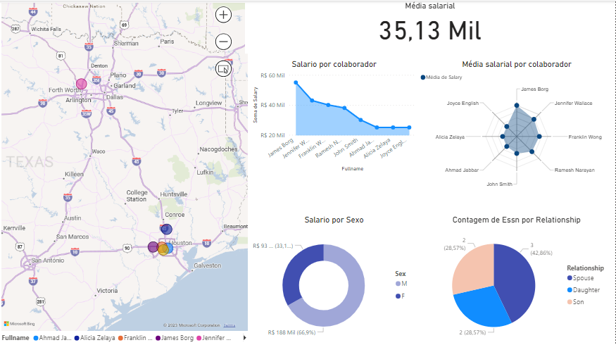

## Dio - Formação Power BI Analyst

### Instruções de Entrega do Desafio

#### Descrição do desafio módulo 3 – Processamento de Dados Simplificado com Power BI

Os arquivos de dados estão disponíveis no github: 

https://github.com/julianazanelatto/power_bi_analyst

Desafio | Conclusão
---------|----------
Criar uma instância na Azure para MySQL | ✅
Criar o Banco de dados com base disponível no github | ✅
Integração do Power BI com MySQL no Azure  | ✅
Verificar problemas na base a fim de realizar a transformação dos dados | ✅
Verifique os cabeçalhos e tipos de dados | ✅
Modifique os valores monetários para o tipo double preciso | ✅
Verifique a existência dos nulos e analise a remoção | ✅
Mescle as colunas de Nome e Sobrenome para ter apenas uma coluna definindo os nomes dos colaboradores | ✅
Verifique se há algum departamento sem gerente | ✅

Mais informações no link abaixo

[Desafio de Projeto - Processando e Transformando Dados com Power BI - Instruções](https://academiapme-my.sharepoint.com/:w:/g/personal/renato_dio_me/EVxAxO7akV5FoNy3mOk_3QwB3wKeyXMaFUi3ekTLQkY_sA?e=eJc3La)

- Print
